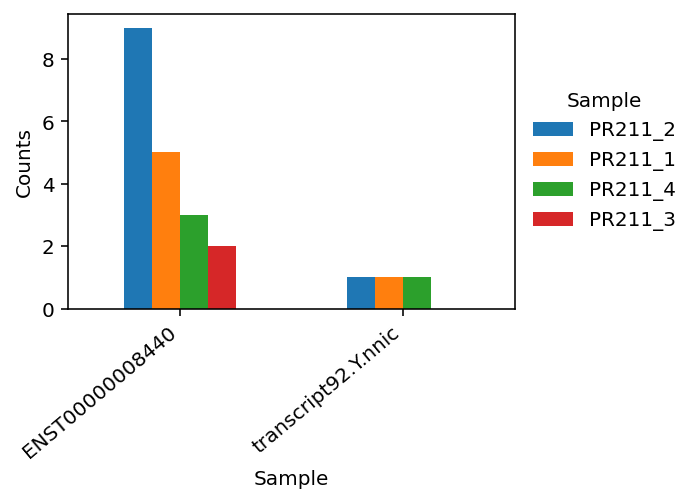
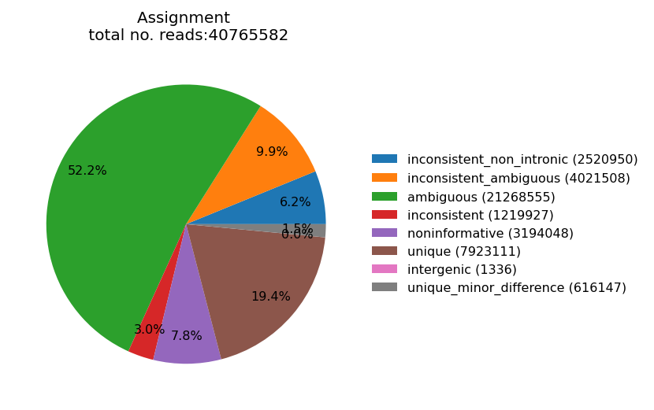
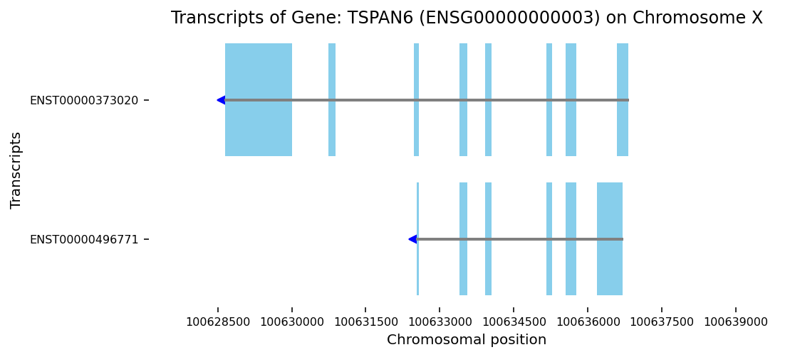
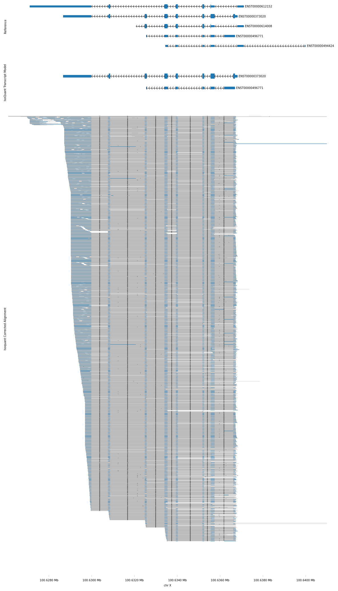

Visualization IsoQuant output
================
Compiled: December 16, 2025

``` r
library(reticulate)
library(glue)

source("local_config.R")  # where the path for conda_path and viewer_code_path are set alternatively, set them as below
# conda_path <- '../miniconda3/envs/isoquant_viewer_R/' # Replace the path to your conda envirnment path
#viewer_code_path <- '../IsoQuant_pipeline/utilities/adapter_isoquantviewer.R' # Replace the path to your location of the R code

use_condaenv(conda_path, required = TRUE) 
use_python(glue("{conda_path}/bin/python"), required = TRUE)
source(viewer_code_path) 
#py_config() # for checking if the session is configured with the environment you specified
```

``` r
#output_directory <- "../prefix/results/isoquant_output/" # path to IsoQuantOutput directory
#prefix <- "prefix" # Name of the project
reference_gtf <- '~/Documents/ref/geneannotations.gff3' # path to reference gene annotation 
viewer<-isoquantViewer(output_directory = output_directory,        
    prefix = prefix, 
    reference_gtf = reference_gtf      
    )

# * Plots are automatically saved in the folder "./plot_output" if plot_output is not defined
```

#### Visualizing read assignment and counts

Function:

- plot_pie_assignment

  Plot pie chart of read assignment (.read_assignments.tsv.gz; stored as
  .reads_assignment) from IsoQuant. “feature_to_plot” are:
  “assignment_type”, “gene_assignment”, “Classification”

- plot_count_bar

  A bar plot of counts for either specified genes or isoforms. If
  providing gene_list, plots stacked barplot of isoforms per gene. If
  providing isoform_list, plots a barplot of specified isoforms.

  Can either be from the raw count or TPM matrix using “layer”, and
  based on the transcript model or the reference annotation
  (use_transcript_model=True or False, default is False). Default is
  plotting all available samples, but can be limited to specific sample
  using “sample_id” = \[sample1, sample2, and etc.\]

``` r
fname<-plot_count_bar(viewer,layer='count',
          isoform_list = list('ENST00000008440','transcript92.Y.nnic'),
          use_transcript_model=TRUE)
knitr::include_graphics(as.character(fname))
```



``` r
fname<-plot_pie_assignment(viewer,feature_to_plot = 'assignment_type')
knitr::include_graphics(as.character(fname))
```



#### Visualizing transcripts within a genomic region

- plot_transcript_map

  Visualize transcript(s) for specified gene(s)/ensembl ID within the
  corresponding genomic region(s). Can be based on the transcript model
  or the reference genome. (Based on IsoQuant:plot_transcript_map)

``` r
fname<-plot_transcript_map(viewer,
                    gene_names=list("TSPAN6"),
                    use_transcript_model=TRUE)
knitr::include_graphics(as.character(fname))
```



- plot_genomic_region

  Visualize a genomic region defined by setting either:

  - region = ‘X:100627109-100639991’
  - gene_name = ‘TSPAN6’
  - or Ensembl_ID = ‘ENSG00000000003’

  using pyGenomeTracks classes
  (<https://pygenometracks.readthedocs.io/en/latest/>).

  The default ordered tracks being plotted are
  \[‘ref’,‘model’,‘reads’\],can be set using “plot_tracks”.

  - ‘ref’: Reference GTF
  - ‘model’: IsoQuant transcript model GTF
  - ‘reads’: IsoQuant corrected alignment BED

  The default parameters for each track can be overwritten using
  tracks_params, by setting key-value pairs for any supported track
  property. (See the list of all available options at at
  <https://pygenometracks.readthedocs.io/en/latest/content/all_tracks.html>)

``` r
fname<-plot_genomic_region(viewer,
                    gene_name = 'TSPAN6')
knitr::include_graphics(as.character(fname))
```


